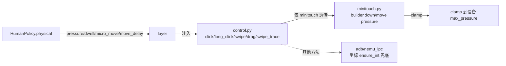

# 操作中间层与拟人化设计（当前实现）

> 本文档与当前代码**一一对应**，描述 `module/operation/` 操作中间层、拟人化策略（`HumanPolicy`）、
> 设备层物理参数链路，以及任务代码的对接方式。
> 代码基线：redroid 分支（截至 2026-08-30）。

---

## 1. 架构总览

```mermaid
graph LR
    T[任务代码 tasks/*] -->|区域指令<br/>act.click(region) / act.swipe(a, b)| L[OperationLayer<br/>module/operation/layer.py]
    L -->|策略选择| S[Policy 策略]
    L -->|执行| D[Device 设备层<br/>module/device/control.py]
    S --> P1[DefaultPolicy<br/>policy.py 零回归]
    S --> P2[HumanPolicy<br/>human.py 拟人化]
    S --> P3[AIPolicy<br/>ai.py 占位]
    D --> M1[click / long_click / swipe]
    D --> M2[swipe_trace 单次连续触摸]
    M1 --> MT[Minitouch 物理参数<br/>pressure/dwell/micro_move/move_delay]
    M2 --> MT
    L -.操作日志.-> LOG[(recorder.py jsonl)]
```

**核心原则**：任务代码只描述"在哪块区域做什么"，具体落点、轨迹、节奏、物理参数全部由**策略层**决定，
设备层保持"最简单的一次性动作"。拟人化/AI 在**不侵入任务代码**的前提下接入。

---

## 2. `module/operation/region.py` —— 区域工具

统一区域表示 `Region = (x, y, w, h)`（ROI 格式），边界语义为 **`[x, x+w-1]`**（左闭右闭，不含 x+w）。

| 函数 | 签名 | 语义 | 对应代码 |
|---|---|---|---|
| `region_center` | `(region) -> (x, y)` | 区域中心，钳制到区域内；退化区域(w/h≤0)返回原点 | region.py |
| `region_random` | `(region, rng=None) -> (x, y)` | 区域内均匀随机落点（= RuleClick.coord 行为） | region.py |
| `region_normal` | `(region, sigma_ratio=1/6, rng=None) -> (x, y)` | 区域内中心截断高斯落点（中心多、边缘稀） | region.py |
| `region_contains` | `(region, x, y) -> bool` | 点是否在区域内 | region.py |
| `clip_to_region` | `(region, x, y) -> (x, y)` | 把点截断到区域内 | region.py |
| `point_region` | `(x, y, w=5, h=5) -> Region` | **中心点语义**：返回 `(x-w//2, y-h//2, w, h)`，区域中心精确落在 (x,y) | region.py |
| `rule_region` | `(rule) -> Region` | 取规则点击区域：`area`(OCR 动态文字框) > `roi_front` > `roi` | region.py |

> 历史演进：`point_region` 曾为左上角语义后改为**中心点语义**（调用方传目标点，落点精确命中）；
> 区域边界曾含 `x+w`（越界 1px），已统一为 `[x, x+w-1]`。

---

## 3. `module/operation/policy.py` —— 策略基类 + DefaultPolicy

### 3.1 Policy 基类（可插拔扩展点）

| 方法 | 签名 | 用途 |
|---|---|---|
| `aim` | `(region) -> (x, y)` | 区域内落点（点击） |
| `path` | `(region_a, region_b) -> list[(x,y)]` | 区域 A→B 轨迹点（首尾固定） |
| `duration` | `(distance) -> float\|None` | 一次动作时长（None=设备默认） |
| `after_click` / `after_swipe` | `() -> float` | 操作后停顿（秒） |
| `move_delay` | `() -> float` | 段间延迟（拟人化已废弃，基类返回 0） |
| `interval` | `(base=0.0) -> float` | 操作间隔（秒） |
| `record` | `(dt=0.0)` | 记录耗时（推进疲劳/学习） |
| `physical` | `() -> dict\|None` | 物理参数快照；None=不注入设备 |

### 3.2 DefaultPolicy（零回归）

| 方法 | 实现 |
|---|---|
| `aim` | `region_random(region)`（区域内均匀随机 = 现状） |
| `path` | `[region_center(a), region_center(b)]`（中心直线，单段） |
| `physical` | `None`（不注入物理参数 → 设备层兜底默认） |

> DefaultPolicy 的 `physical()` 返回 None → layer 不注入 → 设备层用默认值，行为与接入前完全一致。

---

## 4. `module/operation/human.py` —— HumanPolicy 拟人化策略

### 4.1 个体签名（seed 机制）

```python
HumanPolicy.seed_from_name(config_name)   # = sha256(config_name) 前 8 位十六进制
```

- **同账号**：`config_name` 相同 → 种子相同 → 全部签名参数在初始化时确定，重启后**完全一致**
- **跨账号**：`config_name` 不同 → 种子不同 → 签名独立
- **每次操作仍随机**：落点/轨迹/物理值是操作时实时采样，不机械重复

### 4.2 参数表（`__init__` 中 `rng.uniform` 采样，seed 派生）

| 分组 | 参数 | 当前范围 | 含义 |
|---|---|---|---|
| 落点 | `sigma_jitter` | 0.5~2.5 px | 手抖幅度 |
| 落点 | `w_e` | 3.0~8.0 px | 有效宽度（Fitts） |
| 落点 | `alpha_1f` | 0.0~1.0 | 1/f 低频漂移强度 |
| 轨迹 | `curve_bias` | 0.05~0.30 | 垂直弯曲比例×距离 |
| 轨迹 | `track_jitter` | 0.5~2.0 px | 轨迹抖动 |
| 轨迹 | `n_segments` | **10**（基准） | 轨迹段数基准，每次随机 ± |
| 间隔 | `lat_mu` / `lat_sigma` | ln(180)~ln(260) / 0.15~0.30 | 对数正态间隔 |
| 菲茨 | `fitts_a` / `fitts_b` | 0.05~0.20 / 0.10~0.20 s | 移动时间 |
| 按下 | `hold_mu` / `hold_sigma` | ln(55)~ln(110) / 0.15~0.35 | 截断对数正态按下时长 |
| Hick | `rt_c` / `rt_d` | 0.08~0.15 / 0.03~0.07 s | 决策反应时间 |
| 节奏 | `ar_alpha` / `ar_noise` | -0.1~-0.5 / 0.15~0.35 | AR(1) 负自相关 |
| 突发 | `burst_p_aa` / `burst_p_ii` | 0.70~0.95 / 0.80~0.97 | 两态马尔可夫转移概率 |
| 突发 | `burst_active_dt` / `burst_idle_dt` | 0.03~0.10 / 0.10~0.25 s | 密集/稀疏态基间隔 |
| 疲劳 | `fatigue_k` / `fatigue_Tf` | 0.10~0.30 / 1800~3600 s | 疲劳上升/时间常数 |
| 物理 | `press_ratio` | 0.55~0.95 | 按压压力比例 |
| 物理 | `dwell_lo/peak/hi` | 45~peak / 60~110 / peak~180 ms | 按压停留（lo≤peak≤hi） |
| 物理 | `micro_move` | 1.0~3.0 px | 点击微动 σ |
| 物理 | `move_delay_lo/hi` | 6~12 / 14~24 ms | 滑动步间延迟 |

### 4.3 方法清单（全部被执行层调用，无死代码）

| 方法 | 作用 | 接入点 |
|---|---|---|
| `aim(region)` | 两成分对准 + 手抖 + 1/f 漂移，截断在区域内 | `layer.click` |
| `path(a, b)` | 最小 jerk + 弯曲 + 抖动，随机段数，过滤<10px 短段，首尾固定 | `layer.swipe` |
| `_pick_segments(dist)` | 随机段数：基准±2~3，距离每 300px 加 1 段 | path 内部 |
| `physical()` | `{pressure, dwell_ms, micro_move, move_delay_ms}` 全有效值 | `layer.click/swipe` |
| `interval(base)` | 操作间隔 = 突发基 + 决策 + 对数正态 + AR + 疲劳 | `layer._pause` |
| `after_click()` / `after_swipe()` | Hick 决策延时（作为 interval 的 base） | layer |
| `move_time(dist)` | 菲茨定律滑动时长（近快远慢） | `layer.swipe` 校准 move_delay |
| `hold_time(kind)` | 截断对数正态按下时长 | `dwell_ms` 内部 |
| `dwell_ms()` | = `hold_time('tap')*1000` | physical |
| `pressure()` / `micro_move_xy()` / `move_delay_ms()` | 物理参数采样 | physical |
| `burst_step()` | 两态突发性推进 | interval 内部 |
| `record(dt)` / `rest(sec)` | 疲劳推进/回弹 | layer |
| `set_screen(w, h)` | 屏幕边界（钳制不越界） | `layer._apply_screen` |

### 4.4 越界防护（三层）

1. **采样钳制**：`micro_move_xy`/`drift`/轨迹抖动/弯曲 全部钳制到 ±3σ 或 ±30% 距离
2. **区域截断**：`aim` 落点 `clip_to_region` 保证在区域内
3. **屏幕钳制**：`_clip_screen` + `layer._clamp` 保证在屏幕内

---

## 5. `module/operation/layer.py` —— OperationLayer

```python
OperationLayer(device, policy=DefaultPolicy(), recorder=None)
```

| 方法 | 行为 |
|---|---|
| `click(region, name, long_click=False, duration=None)` | `policy.aim` → `physical` 注入 → `device.click/long_click` → `interval(after_click)` |
| `long_click(region, ...)` | = `click(long_click=True)` |
| `swipe(region_a, region_b, name, duration, method)` | 见下 |
| `set_policy(policy)` | 运行时切换策略 |

### 滑动策略（关键）

```python
path = policy.path(region_a, region_b)      # 策略轨迹
if len(path) <= 2:                          # DefaultPolicy：单段
    device.swipe(p1, p2, ...)               # 一次滑动
else:                                       # HumanPolicy：多段 → 单次连续触摸
    path = _dense_path(path)                # 加密到间距 ≤8px
    move_delay = move_time(dist) / len(path) # 菲茨校准每点延迟
    device.swipe_trace(path, ...)           # down->move*->up 单次触摸
```

- **`_dense_path`**：相邻点间距 ≤8px 的线性插值加密
- **`swipe_trace`**：单次触摸（down→move×N→up，中间不抬起）——真人连续拖动，不拆多次短滑
- **`_apply_screen` / `_clamp`**：屏幕边界保险

---

## 6. 设备层物理参数链路



| 文件 | 职责 |
|---|---|
| `control.py` | 高层接口 `click/long_click/swipe/drag/swipe_trace`；`control_method=='minitouch'` 时透传物理参数，其他方法忽略 |
| `minitouch.py` | 底层 `builder.down/move(..., pressure=)`；`click_minitouch(pressure,dwell,micro_move)`、`swipe_minitouch/swipe_trace_minitouch(pressure,move_delay)`；`_clamp_pressure` 钳到设备 `max_pressure` |
| `scrcpy.py` | `swipe_trace_scrcpy` 多点连续触摸（无压力） |
| `adb.py` / `nemu_ipc.py` | 坐标 `ensure_int` 兜底（防 float 崩溃），无压力 |

**兜底原则**：
- 策略启用（HumanPolicy）→ `physical()` 返回全有效值，layer 用 `phys['key']` 直接索引（fail fast），设备层兜底**不可达**
- 策略未启用 / 直接调用设备 → 参数 None，设备层兜底（pressure 100 / 步间 10ms）
- 其他方法（adb 等）不支持压力 → control 层不传，坐标 int 兜底

---

## 7. 与任务代码对接（`tasks/base_task.py`）

```python
# 类属性：显式覆写策略（None=跟随默认）
operation_policy: str | None = None

# __init__
self.act = OperationLayer(self.device, policy=self._make_operation_policy())

# 策略选择：类属性 operation_policy > 配置 operation.policy > 默认 human
def _make_operation_policy(self):
    ...
    return HumanPolicy(seed=HumanPolicy.seed_from_name(config.config_name))
```

**默认启用拟人化**（未显式设置时）：

| 条件 | 策略 |
|---|---|
| 类属性 `operation_policy='human'` 或未设置 | HumanPolicy（拟人化） |
| 配置 `operation.policy='human'` | HumanPolicy |
| 类属性 `operation_policy='default'` 或配置 `operation.policy='default'` | DefaultPolicy（零拟人化） |
| `operation_policy='ai'` / `operation.policy='ai'` | AIPolicy（占位） |

**任务代码用法**：
```python
self.act.click(rule_region(rule), name=rule.name)      # 点击 OCR/图片规则区域
self.act.click(point_region(x, y), name='BTN')          # 点击目标点（中心点语义）
self.act.swipe(rule_region(a), rule_region(b), name='S')  # 区域间滑动
self.act.swipe(region_a, region_b, method='adb')          # 强制 adb 慢速精确滑动
```

---

## 8. 完整数据流（一次点击 / 一次滑动）

### 点击
```
act.click(region)
  → policy.aim(region)             # 拟人落点（区域内）
  → policy.physical()              # {pressure, dwell_ms, micro_move, move_delay_ms}
  → device.click(x, y, pressure, dwell, micro_move)
      → control.click → minitouch: down(pressure) → wait(dwell) → move(micro) → up
  → policy.record(dt)              # 推进疲劳
  → _pause(policy.interval(after_click()))  # 决策+间隔+突发+疲劳
```

### 滑动
```
act.swipe(region_a, region_b)
  → policy.path(a, b)              # 拟人轨迹（随机段数、弯曲、抖动）
  → _dense_path                    # 加密间距 ≤8px
  → device.swipe_trace(path, pressure, move_delay)   # down→move*→up 单次触摸
      → move_delay 由 move_time(菲茨) 校准
  → policy.record(dt) → _pause(policy.interval(after_swipe()))
```

---

## 9. 历史踩坑与已规避（当前代码已内置）

| 坑 | 当前方案 |
|---|---|
| 分段滑动防卡死误判（每次拆多段 device 调用） | 多段轨迹改用**单次 `swipe_trace`**，仅一次触摸 |
| 短段 <10px 被 distance_check 丢弃 | path 过滤短段 + `_dense_path` 加密 |
| 落点越界 | 采样 ±3σ 钳制 + 区域截断 + 屏幕钳制三层 |
| 拟人化未真正生效（节奏方法死代码） | `interval/burst/move_time/hold_time` 全部接入执行层 |
| 固定采样段数像机器 | `_pick_segments` 每次随机段数 |
| 默认未启用拟人化 | `_make_operation_policy` 默认 `human` |
